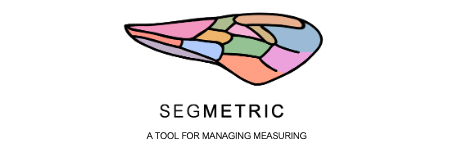

<p align="center">
  
</p>

SegMetric is eight PyQt6 desktop tools that cover a full workflow: split a
scan into panels, build a naming/metadata scheme, compute a real-world
scale from ArUco markers (or set it manually), then mask, segment, and
landmark each object for measurement.

## The tools

| Tool | What it does |
|---|---|
| [`segmetric.tag`](tag.html) | Splits scans into named panels, optionally using OCR |
| [`segmetric.set`](set.html) | Builds filename-to-metadata presets, including an Object ID |
| [`segmetric.scale`](scale.html) | Computes real-world scale from ArUco markers (or manual calibration) and crops |
| [`segmetric.prepare`](prepare.html) | Combines tag + scale into one streamlined run |
| [`segmetric.mask`](mask.html) | Generates and corrects a binary mask per object, measures length/width |
| [`segmetric.segment`](segment.html) | Click-select follow-up to mask: detects and measures cells/segments |
| [`segmetric.landmark`](landmark.html) | Freeform geometric-morphometric landmark placement |
| [`segmetric.measure`](measure.html) | A shared shell that runs mask, segment, and landmark together |

## Install

```bash
pip install segmetric-toolkit
```

This installs every tool above as a console command (`segmetric-tag`,
`segmetric-set`, `segmetric-scale`, `segmetric-prepare`, `segmetric-mask`,
`segmetric-segment`, `segmetric-landmark`, `segmetric-measure`). Requires
Python 3.10+.

If you want to edit the code itself, see the
[source install instructions](https://github.com/{{ site.repository }}#install-from-source-conda-for-development-and-editing)
in the repository README.

## Links

- [Source code on GitHub](https://github.com/{{ site.repository }})
- [Package on PyPI](https://pypi.org/project/segmetric-toolkit/)
